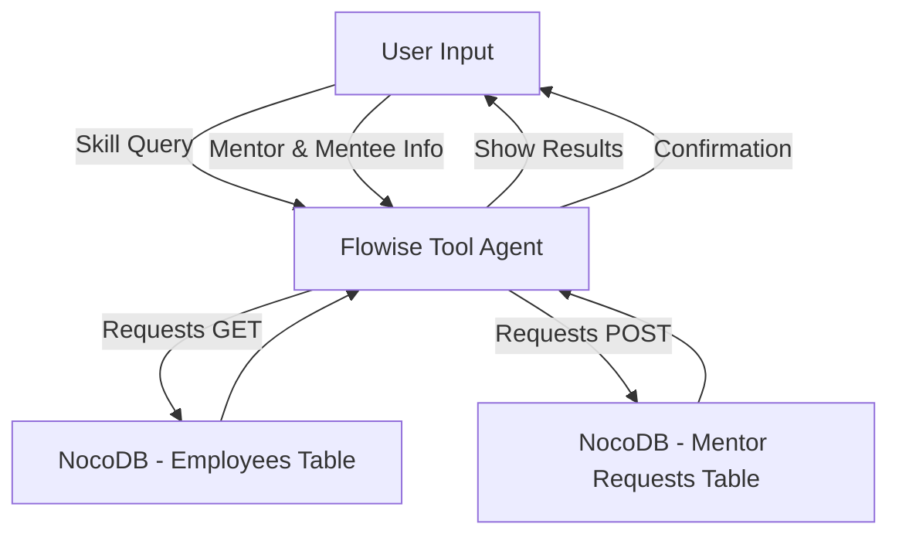

# 🤖 Employee Finder Chatbot (Flowise + NocoDB)

This project is an AI-powered chatbot built with **[Flowise](https://flowiseai.com/)** that connects to **[NocoDB](https://nocodb.com/)** for employee data search and notifications.

It allows users to:

- Search for employees by skill.
- Get details such as name, email, and skills.
- Send a connection request to a selected mentor by providing their email.
- Automatically log the connection request into NocoDB via an API call.

---

## ✨ Features

- 🔍 **Skill-based employee search** using NocoDB queries.
- 📧 **Follow-up prompts** to collect mentor email, mentee email, and name.
- 🔄 **POST requests** to NocoDB to log connection requests.
- ⚡ Works entirely inside **Flowise** with **Tool Agent** and **HTTP Request nodes**.
- 🗂️ Maintains conversation context with memory support.

---

## 🏗️ Architecture



## ⚙️ Setup

`git clone https://github.com/yourusername/employee-finder-chatbot.git`
`cd employee-finder-chatbot`
`npm install -g flowise`
`flowise start`
`http://localhost:3000`

## 3. Configure NocoDB

- Create two tables inside NocoDB:
- Employees table
- name (string)
- email (string)
- skill (string)
- Mentor Requests table
- matched_skill (string)
- status (string)
- mentee_email (string)
- mentor_email (string)

## 4. Add API Token

Get your NocoDB API Token from NocoDB settings and add it as a header in Flowise HTTP nodes:

```
{
  "xc-auth": "your_api_token",
  "Content-Type": "application/json"
}
```

## 🔌 Flowise Configuration

Requests GET Node

### URL

` https://nocodb.yourdomain/api/v2/tables/employees/records

### Query Params

`{
  "viewId": "your_view_id",
  "where": "(skill,eq,{{input.skill}})"
}`

## 🗣️ Conversation Flow

User: “Find me React developers”

Bot → Queries NocoDB → Returns employee list.

Bot: “Please type the mentor’s email, your email, and your name, and I will send a connection request.”

User: “mentor@company.com
, my@email.com
, John Doe”

Bot → Creates POST record in NocoDB.

Bot: “✅ Connection request sent to mentor@company.com
”

## 📌 Roadmap

- Add multiple filters (skill + department).
- Add Slack/Email notification integration.
- Add support for approving/declining mentor requests.
- Deploy Flowise chatbot as a web widget.
