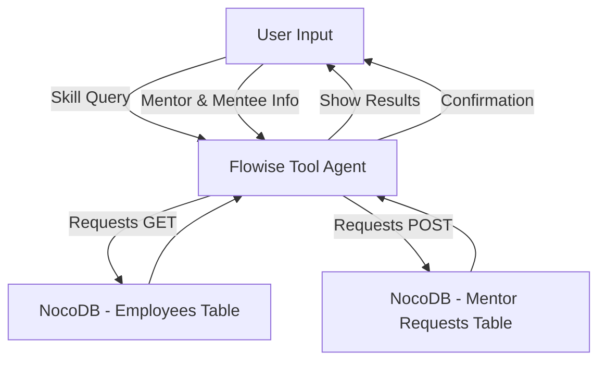

# 🤖 Employee Finder Chatbot (Flowise + NocoDB)

This project is an AI-powered chatbot built with **[Flowise](https://flowiseai.com/)** that connects to **[NocoDB](https://nocodb.com/)** for employee data search and notifications.

It allows users to:

- Search for employees by skill.
- Get details such as name, email, and skills.
- Send a connection request to a selected mentor by providing their email.
- Automatically log the connection request into NocoDB via an API call.

---

## ✨ Features

- 🔍 **Skill-based employee search** using NocoDB queries.
- 📧 **Follow-up prompts** to collect mentor email, mentee email, and name.
- 🔄 **POST requests** to NocoDB to log connection requests.
- ⚡ Works entirely inside **Flowise** with **Tool Agent** and **HTTP Request nodes**.
- 🗂️ Maintains conversation context with memory support.

---

## 🏗️ Architecture

## ⚙️ Setup

`git clone https://github.com/yourusername/employee-finder-chatbot.git
 cd employee-finder-chatbot`
